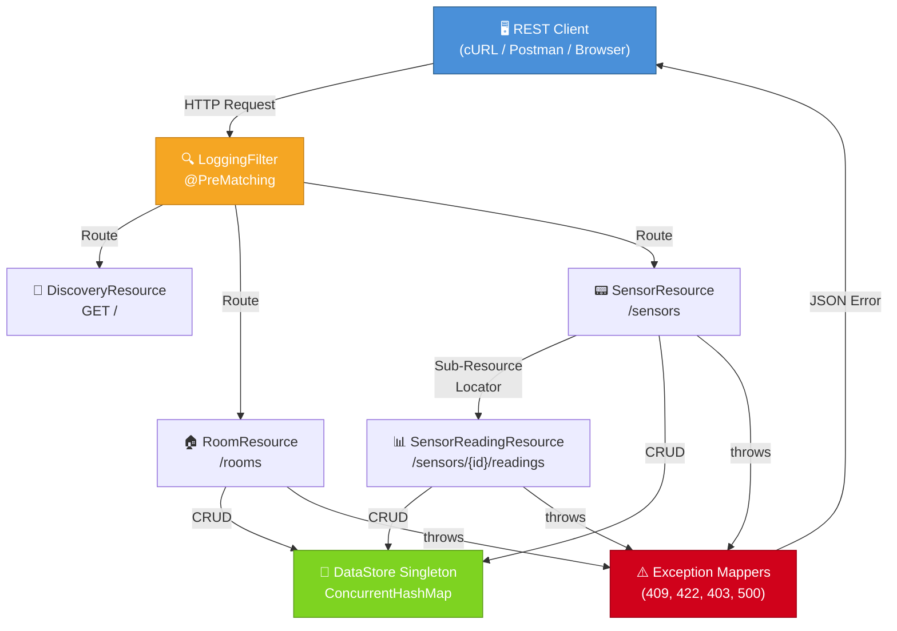
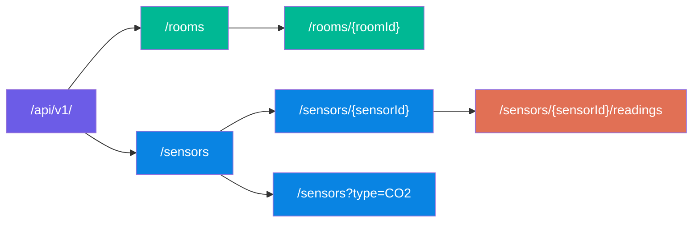
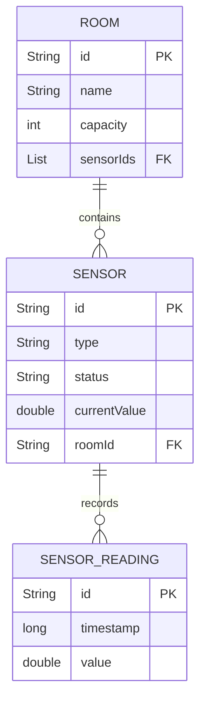

# 🏛️ SmartCampus API — Smart Campus Sensor & Room Management REST API

> **Module:** 5COSC022W — Client-Server Architectures  
> **Student:** Thevinu Jayasekara  
> **Student ID:** w2152987 / 20241953
> **GitHub:** [INSERT LINK HERE]

---

## 📋 Table of Contents

1. [Project Overview](#-project-overview)
2. [Technology Stack](#-technology-stack)
3. [Project Structure](#-project-structure)
4. [Setup & Run Guide](#-setup--run-guide)
5. [API Design Overview](#-api-design-overview)
6. [Endpoint Summary](#-endpoint-summary)
7. [Sample cURL Commands](#-sample-curl-commands)
8. [Written Report](#-written-report)

---

## 🧠 Project Overview

**SmartCampusAPI** is a fully RESTful web service for managing rooms and IoT sensors within a university smart campus environment. The API enables clients to register physical rooms, deploy virtual sensor records (e.g., CO2, Temperature), and submit real-time sensor readings — all through a clean, standards-compliant HTTP interface.

### Key Highlights

- **Pure JAX-RS (Jersey 2.39.1)** implementation — zero Spring Boot dependencies.
- **In-Memory Persistence** via a thread-safe Singleton `DataStore` using `ConcurrentHashMap` and `CopyOnWriteArrayList`.
- **Sub-Resource Locator** pattern for nested `/sensors/{id}/readings` endpoints.
- **Custom Exception Mappers** producing structured JSON error responses for `400`, `404`, `409`, `422`, and `500` status codes.
- **Pre-Matching Logging Filter** for request/response auditing.
- **HATEOAS Discovery Endpoint** at the API root.

---

## 🔧 Technology Stack

| Layer | Technology |
|---|---|
| Language | Java 11 |
| API Framework | JAX-RS 2.1 (Jersey 2.39.1) |
| HTTP Server | Embedded Grizzly 2 / Apache Tomcat 9 |
| JSON Binding | Jackson (via `jersey-media-json-jackson`) |
| DI Container | HK2 (via `jersey-hk2`) |
| Build Tool | Apache Maven |
| Data Storage | In-Memory (`ConcurrentHashMap`, `CopyOnWriteArrayList`) |
| Database | **None** — strictly in-memory as per coursework rules |

---

## 📁 Project Structure

```
src/main/java/com/smartcampus/
├── Main.java                          # Grizzly server bootstrap
├── SmartCampusApplication.java        # JAX-RS Application config
├── model/
│   ├── Room.java                      # Room entity (id, name, capacity, sensorIds)
│   ├── Sensor.java                    # Sensor entity (id, type, status, currentValue, roomId)
│   └── SensorReading.java            # Reading entity (id, timestamp, value)
├── store/
│   └── DataStore.java                 # Singleton in-memory data store
├── resource/
│   ├── DiscoveryResource.java         # GET / — API discovery & HATEOAS links
│   ├── RoomResource.java              # /rooms — full CRUD
│   ├── SensorResource.java            # /sensors — full CRUD + sub-resource locator
│   └── SensorReadingResource.java     # Sub-resource for /sensors/{id}/readings
├── exception/
│   ├── RoomNotEmptyException.java             # Thrown on delete of occupied room
│   ├── LinkedResourceNotFoundException.java   # Thrown on invalid foreign key reference
│   ├── SensorUnavailableException.java        # Thrown when sensor is in MAINTENANCE
│   └── mapper/
│       ├── RoomNotEmptyExceptionMapper.java           # → 409 Conflict
│       ├── LinkedResourceNotFoundExceptionMapper.java # → 422 Unprocessable Entity
│       ├── SensorUnavailableExceptionMapper.java      # → 403 Forbidden
│       └── GlobalExceptionMapper.java                 # → 500 Internal Server Error
└── filter/
    └── LoggingFilter.java             # @PreMatching request/response logger
```

---

## 🚀 Setup & Run Guide

### Prerequisites

- **Java JDK 11** or higher
- **Apache Maven 3.6+**
- **Apache Tomcat 9** (for WAR deployment) or run standalone with Grizzly
- **NetBeans IDE** (recommended) or any Java IDE

### Option A — Run Standalone (Grizzly)

```bash
# 1. Clone the repository
git clone [INSERT GITHUB LINK HERE]
cd SmartCampusAPI

# 2. Build the project
mvn clean package

# 3. Run the server
java -jar target/SmartCampusAPI-1.0-SNAPSHOT.jar
```

The server will start at: **`http://localhost:8080/api/v1/`**  
Press `ENTER` in the terminal to stop.

### Option B — Deploy to Tomcat via NetBeans

1. **Open NetBeans IDE** → `File` → `Open Project` → select the cloned project folder.
2. **Register Tomcat 9:** Go to `Tools` → `Servers` → `Add Server` → select your Tomcat 9 installation directory.
3. **Set Tomcat as target:** Right-click the project → `Properties` → `Run` → set Server to `Apache Tomcat 9`.
4. **Build:** Right-click the project → `Clean and Build`.
5. **Deploy:** Right-click the project → `Run`. NetBeans will deploy the WAR to Tomcat automatically.
6. **Access the API** at: `http://localhost:8080/SmartCampusAPI/api/v1/`

---

## 🏗️ API Design Overview

### System Architecture



### Resource Hierarchy



### Entity Relationship Diagram



---

## 📡 Endpoint Summary

### Discovery

| Method | Endpoint | Description | Status |
|---|---|---|---|
| `GET` | `/api/v1/` | API discovery with HATEOAS links | `200 OK` |

### Rooms

| Method | Endpoint | Description | Status |
|---|---|---|---|
| `GET` | `/api/v1/rooms` | List all rooms | `200 OK` |
| `POST` | `/api/v1/rooms` | Create a new room | `201 Created` |
| `GET` | `/api/v1/rooms/{roomId}` | Get a specific room | `200 OK` / `404` |
| `PUT` | `/api/v1/rooms/{roomId}` | Update a room | `200 OK` / `404` |
| `DELETE` | `/api/v1/rooms/{roomId}` | Delete a room (if empty) | `204 No Content` / `409` |

### Sensors

| Method | Endpoint | Description | Status |
|---|---|---|---|
| `GET` | `/api/v1/sensors` | List all sensors | `200 OK` |
| `GET` | `/api/v1/sensors?type={type}` | Filter sensors by type | `200 OK` |
| `POST` | `/api/v1/sensors` | Create a new sensor | `201 Created` / `422` |
| `GET` | `/api/v1/sensors/{sensorId}` | Get a specific sensor | `200 OK` / `404` |
| `PUT` | `/api/v1/sensors/{sensorId}` | Update a sensor | `200 OK` / `404` |
| `DELETE` | `/api/v1/sensors/{sensorId}` | Delete a sensor | `204 No Content` / `404` |

### Sensor Readings (Sub-Resource)

| Method | Endpoint | Description | Status |
|---|---|---|---|
| `GET` | `/api/v1/sensors/{sensorId}/readings` | Get all readings for a sensor | `200 OK` / `404` |
| `POST` | `/api/v1/sensors/{sensorId}/readings` | Submit a new reading | `201 Created` / `403` |

### Error Responses

| Status Code | Meaning | Trigger |
|---|---|---|
| `400 Bad Request` | Missing or blank `id` field | Validation failure on POST |
| `404 Not Found` | Resource does not exist | GET/PUT/DELETE with invalid ID |
| `409 Conflict` | Duplicate ID or room has sensors | POST duplicate / DELETE occupied room |
| `422 Unprocessable Entity` | Referenced resource missing | POST sensor with non-existent `roomId` |
| `403 Forbidden` | Sensor in MAINTENANCE mode | POST reading to unavailable sensor |
| `500 Internal Server Error` | Unexpected server error | Unhandled exception (stack trace hidden) |

---

## 🧪 Sample cURL Commands

### Discovery

```bash
# Get API info and HATEOAS links
curl -s http://localhost:8080/api/v1/ | python3 -m json.tool
```

### Room Operations

```bash
# List all rooms
curl -s http://localhost:8080/api/v1/rooms | python3 -m json.tool

# Create a room
curl -s -X POST http://localhost:8080/api/v1/rooms \
  -H "Content-Type: application/json" \
  -d '{"id":"LIB-301","name":"Library Quiet Study","capacity":50}' \
  | python3 -m json.tool

# Get a specific room
curl -s http://localhost:8080/api/v1/rooms/LIB-301 | python3 -m json.tool

# Update a room
curl -s -X PUT http://localhost:8080/api/v1/rooms/LIB-301 \
  -H "Content-Type: application/json" \
  -d '{"name":"Library Main Hall","capacity":120}' \
  | python3 -m json.tool

# Delete a room (only works if no sensors are attached)
curl -s -X DELETE http://localhost:8080/api/v1/rooms/LIB-301 -w "\nHTTP Status: %{http_code}\n"
```

### Sensor Operations

```bash
# Create a sensor (room must exist first)
curl -s -X POST http://localhost:8080/api/v1/sensors \
  -H "Content-Type: application/json" \
  -d '{"id":"CO2-001","type":"CO2","status":"ACTIVE","currentValue":400,"roomId":"LIB-301"}' \
  | python3 -m json.tool

# List all sensors
curl -s http://localhost:8080/api/v1/sensors | python3 -m json.tool

# Filter sensors by type
curl -s "http://localhost:8080/api/v1/sensors?type=CO2" | python3 -m json.tool

# Get a specific sensor
curl -s http://localhost:8080/api/v1/sensors/CO2-001 | python3 -m json.tool

# Update a sensor
curl -s -X PUT http://localhost:8080/api/v1/sensors/CO2-001 \
  -H "Content-Type: application/json" \
  -d '{"type":"CO2","status":"ACTIVE","currentValue":420,"roomId":"LIB-301"}' \
  | python3 -m json.tool

# Delete a sensor
curl -s -X DELETE http://localhost:8080/api/v1/sensors/CO2-001 -w "\nHTTP Status: %{http_code}\n"
```

### Sensor Reading Operations

```bash
# Submit a new reading
curl -s -X POST http://localhost:8080/api/v1/sensors/CO2-001/readings \
  -H "Content-Type: application/json" \
  -d '{"value":450.5}' \
  | python3 -m json.tool

# Get all readings for a sensor
curl -s http://localhost:8080/api/v1/sensors/CO2-001/readings | python3 -m json.tool
```

### Testing Error Scenarios

```bash
# 409 — Attempt to delete a room that still has sensors
curl -s -X DELETE http://localhost:8080/api/v1/rooms/LIB-301 | python3 -m json.tool

# 422 — Create sensor with non-existent roomId
curl -s -X POST http://localhost:8080/api/v1/sensors \
  -H "Content-Type: application/json" \
  -d '{"id":"TEMP-X","type":"TEMP","status":"ACTIVE","currentValue":22,"roomId":"FAKE-999"}' \
  | python3 -m json.tool

# 400 — Create room with missing id
curl -s -X POST http://localhost:8080/api/v1/rooms \
  -H "Content-Type: application/json" \
  -d '{"name":"No ID Room","capacity":10}' \
  | python3 -m json.tool
```

---

## 📝 Written Report

### Question 1 — JAX-RS Resource Lifecycle and In-Memory Data Management

In the JAX-RS specification (JSR 370), the default lifecycle of a resource class is **per-request**. This means that the JAX-RS runtime — in this project, Jersey 2.39.1 — instantiates a fresh object of each resource class (e.g., `RoomResource`, `SensorResource`) for every incoming HTTP request. Once the response is dispatched, the instance becomes eligible for garbage collection. This stands in contrast to a singleton lifecycle, where a single instance would serve all concurrent requests.

This per-request model has a critical implication for in-memory data management. If data were stored as instance fields within a resource class — for example, a `HashMap<String, Room>` declared directly inside `RoomResource` — every request would receive an empty, uninitialised map. Data written during one POST request would be irrecoverably lost by the time the next GET request arrived, because the previous instance and its fields would have already been destroyed. This would render the API entirely stateless in the worst sense: not merely stateless at the protocol level (which REST encourages), but stateless at the application-data level (which would be a critical defect).

To resolve this, the SmartCampus project employs the **Singleton design pattern** in the `DataStore` class. A single `DataStore` instance, held in a `private static final` field and accessed via `DataStore.getInstance()`, persists for the entire lifetime of the JVM. Every resource class, regardless of how many instances are created across concurrent requests, accesses the same `DataStore` reference. The data structures within — `ConcurrentHashMap` for rooms and sensors, and `CopyOnWriteArrayList` for sensor readings — are specifically chosen from the `java.util.concurrent` package to provide built-in thread safety. The `ConcurrentHashMap` uses lock striping to allow concurrent reads and segmented writes without requiring explicit synchronisation, while the `CopyOnWriteArrayList` creates a fresh copy of the underlying array on each mutation, making it ideal for the read-heavy, write-infrequent pattern typical of sensor readings.

---

### Question 2 — The Role of HATEOAS in Advanced RESTful Design

Hypermedia as the Engine of Application State (HATEOAS) represents the highest maturity level of RESTful design, corresponding to Level 3 of the Richardson Maturity Model. In essence, a HATEOAS-compliant API embeds navigational hyperlinks within its responses, enabling the client to discover available actions and related resources dynamically rather than relying on hardcoded URL construction.

In the SmartCampus API, the `DiscoveryResource` at `GET /api/v1/` returns a JSON payload that includes a `_links` object containing URIs for `/api/v1/rooms` and `/api/v1/sensors`. This is a foundational implementation of HATEOAS: a client application needs only the root URI as its single entry point. From there, it can programmatically follow the embedded links to discover the rooms collection, the sensors collection, and subsequently any nested resources.

The advantage over static documentation (such as a Swagger page or a PDF specification) is robustness to change. If the API versioning scheme evolves (e.g., from `/api/v1/` to `/api/v2/`), or if resource paths are restructured, a HATEOAS-driven client adapts automatically by following the updated links. A client that has hardcoded `/api/v1/rooms` into its source code, by contrast, would break silently. HATEOAS thus reduces coupling between client and server, which is particularly valuable in an IoT smart-campus environment where heterogeneous devices — thermostats, CO2 monitors, occupancy dashboards — may be developed by different teams and updated on independent release cycles.

---

### Question 3 — Returning Full Objects vs. IDs Only

When the `GET /api/v1/rooms` endpoint returns the full list of `Room` objects (including `id`, `name`, `capacity`, and `sensorIds`), it adopts an **eager loading** strategy. The alternative — returning only a list of room IDs (e.g., `["LIB-301", "ENG-102"]`) — constitutes a **lazy loading** approach.

**Returning full objects** increases the payload size per response, consuming more network bandwidth. However, it enables the client to render a complete rooms overview (e.g., a dashboard table showing names and capacities) in a single round trip. For a smart-campus monitoring dashboard that must display all rooms simultaneously, this eliminates the so-called **N+1 request problem**, where the client would need to issue one request for the list of IDs, followed by N individual `GET /rooms/{id}` requests to hydrate each room's details.

**Returning IDs only** minimises the initial payload to a few bytes per entry, which is advantageous when the client only needs to check existence or count, or when objects are extremely large. However, in the SmartCampus domain, a `Room` object comprises only a handful of lightweight string and integer fields, so the bandwidth savings would be negligible. The latency cost of N+1 follow-up requests would far exceed the marginal bandwidth savings, particularly in a campus network where sensor dashboards poll the API at regular intervals.

The SmartCampus API therefore returns full objects, which represents the pragmatically superior design choice for this domain's typical access patterns.

---

### Question 4 — Idempotency of the DELETE Operation

In the SmartCampus implementation, the `DELETE /api/v1/rooms/{roomId}` operation is **not strictly idempotent** in terms of response codes, though it is idempotent in terms of server-side effect.

Upon the first valid invocation, the resource class retrieves the room from the `DataStore`, verifies that no sensors reference it, removes it from the `ConcurrentHashMap`, and returns HTTP `204 No Content`. If the same DELETE request is issued a second time with the identical `roomId`, the `store.getRooms().get(roomId)` call returns `null`, and the method returns HTTP `404 Not Found` with a JSON error body.

From a **server-state perspective**, this is idempotent: executing the operation once or multiple times leaves the server in the same final state — the room is absent from the store. The resource was deleted on the first call and remains absent on subsequent calls; no additional data is mutated. This aligns with the HTTP specification (RFC 7231, §4.2.2), which defines idempotency in terms of the intended effect on the server, not the response code.

However, from a **response-code perspective**, the behaviour differs between the first call (204) and subsequent calls (404). Some API design philosophies argue that a truly idempotent DELETE should return 204 even if the resource has already been removed, to ensure that retried requests (e.g., due to network timeouts) do not confuse the client. The SmartCampus implementation chooses the more informative approach of returning 404 for already-deleted resources, which provides clearer feedback to the client at the cost of strict response-code uniformity.

---

### Question 5 — Content-Type Enforcement via @Consumes

The `@Consumes(MediaType.APPLICATION_JSON)` annotation on POST and PUT methods in the SmartCampus resource classes declares a strict content-type contract. It instructs the JAX-RS runtime that these methods exclusively accept request bodies encoded as `application/json`.

When a client sends a request with a mismatched `Content-Type` header — for example, `Content-Type: text/plain` — the Jersey runtime's content negotiation mechanism intervenes **before** the resource method is ever invoked. Jersey inspects the incoming `Content-Type` header, compares it against the media types declared in `@Consumes`, and finds no compatible match. It then immediately returns an HTTP **`415 Unsupported Media Type`** response, without deserialising the body or executing any application logic.

This behaviour provides two significant benefits. First, it acts as an **input validation gate** at the framework level, preventing malformed or incorrectly encoded data from reaching business logic. If a client mistakenly sends a URL-encoded form (`application/x-www-form-urlencoded`) to the `POST /rooms` endpoint, Jersey rejects it outright rather than attempting to parse it as a `Room` object, which would result in an unpredictable `NullPointerException` or a malformed entity. Second, it enforces **API contract clarity**: clients receive an unambiguous 415 error that directly communicates the problem (wrong media type), rather than a confusing 400 or 500 that would require debugging.

---

### Question 6 — @QueryParam Filtering vs. Path-Based Filtering

The SmartCampus API implements sensor filtering via `@QueryParam("type")` on the `GET /api/v1/sensors` endpoint, allowing requests such as `GET /sensors?type=CO2`. An alternative design would embed the filter criterion in the URL path: `GET /api/v1/sensors/type/CO2`.

The query-parameter approach is generally considered superior for filtering for several reasons grounded in REST architectural principles:

1. **Semantic correctness.** In REST, each path segment identifies a distinct resource or resource collection. The path `/sensors/type/CO2` implies that `type` is a sub-resource of `sensors` and `CO2` is a sub-resource of `type`, which misrepresents the domain model. In reality, the client is requesting the same `sensors` collection with a filter applied, not navigating to a different resource.

2. **Composability.** Query parameters are inherently composable. A future requirement to filter by both type and status would naturally extend to `?type=CO2&status=ACTIVE`. With path segments, this combinatorial explosion becomes unwieldy: `/sensors/type/CO2/status/ACTIVE` creates a rigid, deeply nested URL structure that must account for every permutation of filter ordering.

3. **Optionality.** The `@QueryParam` is inherently optional — omitting it returns the unfiltered collection. A path-based design would require a separate endpoint for the unfiltered case (`/sensors`) and additional endpoints for each filtered variant, violating the DRY principle.

4. **Caching and proxy behaviour.** HTTP caches and CDNs treat the path and query string as a combined cache key. Query-parameter-based filtering aligns with standard caching semantics, whereas path-based filtering can pollute cache hierarchies with variant path structures that represent logically identical operations.

---

### Question 7 — Architectural Benefits of Sub-Resource Locators

The Sub-Resource Locator pattern, as implemented in `SensorResource`, delegates all requests matching `/sensors/{sensorId}/readings` to a separate `SensorReadingResource` class. The locator method carries a `@Path` annotation but deliberately omits any HTTP method annotation (`@GET`, `@POST`), signalling to Jersey that it is a routing mechanism rather than a terminal handler.

This pattern offers substantial architectural benefits for managing complexity in large APIs:

**Separation of Concerns.** The `SensorResource` class is responsible exclusively for CRUD operations on sensors, while `SensorReadingResource` encapsulates all reading-related logic. Without this delegation, a single `SensorResource` class would accumulate methods for `GET /sensors`, `POST /sensors`, `GET /sensors/{id}`, `PUT /sensors/{id}`, `DELETE /sensors/{id}`, `GET /sensors/{id}/readings`, and `POST /sensors/{id}/readings` — seven endpoints in one class. This violates the Single Responsibility Principle and produces classes that are difficult to navigate, test, and maintain.

**Contextual Initialisation.** The sub-resource locator instantiates `SensorReadingResource` with the `sensorId` as a constructor parameter. This contextualises the sub-resource: every method within `SensorReadingResource` operates within the scope of a specific sensor, without repeatedly extracting and validating the `sensorId` path parameter. This mirrors the conceptual domain relationship — readings belong to a sensor — in the code structure itself.

**Scalability of Design.** If the API were extended with additional nested resources (e.g., `/sensors/{id}/maintenance-logs` or `/sensors/{id}/calibration-history`), each could be implemented as an independent sub-resource class and wired through an additional locator method. The `SensorResource` class grows by one locator method per nested resource, rather than by an unbounded number of handler methods.

---

### Question 8 — HTTP 422 vs. 404 for Missing References

When a client submits `POST /api/v1/sensors` with a valid JSON body containing a `roomId` that does not correspond to any existing room, the SmartCampus API throws a `LinkedResourceNotFoundException`, which the corresponding exception mapper translates to HTTP **422 Unprocessable Entity** rather than 404 Not Found.

This distinction is semantically important. HTTP 404 indicates that the **target resource of the request** — identified by the request URI — does not exist. In this scenario, the target resource is `/api/v1/sensors`, which very much exists and is fully operational. The issue lies not with the endpoint but with the **content of the request payload**: the JSON body references a `roomId` that cannot be resolved against the server's current state.

HTTP 422, defined in RFC 4918, conveys precisely this meaning: the server understands the content type (`application/json`), can parse the request body syntactically, but is unable to process it because it is **semantically invalid**. The `roomId` field is structurally correct (it is a valid string) but logically invalid (it points to a non-existent entity). This is analogous to a well-formed SQL INSERT statement that violates a foreign-key constraint — the syntax is correct, but the referential integrity check fails.

Returning 404 in this context would mislead the client into believing that the `/sensors` endpoint itself is missing or misconfigured, prompting unnecessary debugging of the URL structure rather than the request body content. The 422 response, accompanied by a descriptive JSON error message (`"Room with id 'FAKE-999' does not exist"`), directs the client's attention to the actual defect: the payload's referential data.

---

### Question 9 — Cybersecurity Risks of Exposing Stack Traces

Exposing internal Java stack traces to external API consumers constitutes a significant information disclosure vulnerability, classified under OWASP Top 10 category **A01:2021 — Broken Access Control** and **A05:2021 — Security Misconfiguration**.

A Java stack trace reveals several categories of sensitive information:

1. **Internal class and package structure.** Traces expose fully qualified class names such as `com.smartcampus.store.DataStore` or `com.smartcampus.resource.SensorResource.createSensor()`, revealing the application's internal architecture, naming conventions, and module decomposition. An attacker can use this to map the application's surface area and identify high-value targets (e.g., data-access classes).

2. **Framework and library versions.** Stack frames from third-party libraries (e.g., `org.glassfish.jersey.server.ServerRuntime`) disclose the exact framework and version in use. An attacker can cross-reference this against the Common Vulnerabilities and Exposures (CVE) database to identify known exploits specific to that version.

3. **File paths and line numbers.** Traces may include absolute file paths (e.g., `/opt/tomcat/webapps/SmartCampusAPI/...`) and source file line numbers, which reveal the server's operating system, deployment directory structure, and application layout.

4. **Exception types and error context.** The exception message and type (e.g., `NullPointerException at DataStore.java:41`) can hint at unvalidated input paths, missing null checks, or exploitable edge cases that an attacker could trigger deliberately.

The SmartCampus API mitigates this through the `GlobalExceptionMapper`, which catches all unhandled `Throwable` instances, logs the full stack trace server-side at `SEVERE` level for developer diagnosis, and returns only a generic JSON message — `"An unexpected error occurred. Please contact support."` — to the client. This ensures that operational debugging capability is preserved without leaking implementation details to potential adversaries.

---

### Question 10 — JAX-RS Filters vs. Manual Logging

The SmartCampus API employs a `LoggingFilter` class annotated with `@Provider` and `@PreMatching`, implementing both `ContainerRequestFilter` and `ContainerResponseFilter`. This approach offers several decisive advantages over manually inserting `Logger.info()` statements within every resource method.

**Centralisation and DRY principle.** The filter consolidates all request/response logging into a single class. Without it, every resource method across `RoomResource`, `SensorResource`, `SensorReadingResource`, and `DiscoveryResource` would require identical boilerplate logging statements at the method entry and exit points. With 12+ endpoints in the current API, this amounts to at least 24 manual logging calls that must be individually written, maintained, and kept consistent. The filter replaces all of these with exactly two methods.

**Completeness of coverage.** The `@PreMatching` annotation ensures the filter executes before JAX-RS performs resource matching. This means it captures every incoming request, including those that result in 404 (no matching resource), 405 (method not allowed), or 415 (unsupported media type) responses generated by the framework itself. Manual logging inside resource methods would completely miss these cases, creating blind spots in the audit trail.

**Separation of cross-cutting concerns.** Logging is a cross-cutting concern — it applies uniformly across all endpoints but is orthogonal to their business logic. Embedding logging within resource methods violates the Single Responsibility Principle by interleaving infrastructure concerns with domain logic. The filter-based approach cleanly separates these concerns, keeping resource methods focused exclusively on their CRUD responsibilities.

**Maintainability and extensibility.** Modifying the log format, adding fields (e.g., request duration, client IP), or switching logging frameworks requires editing only the `LoggingFilter` class. With manual logging, the same change would necessitate touching every resource method — a tedious, error-prone refactoring process that scales poorly as the API grows.

---

## References

Course module: 5COSC022W — University of Westminster
No Spring Boot or database technology was used, as required by the coursework brief