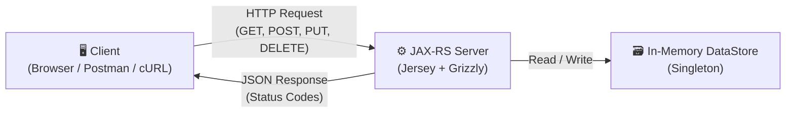
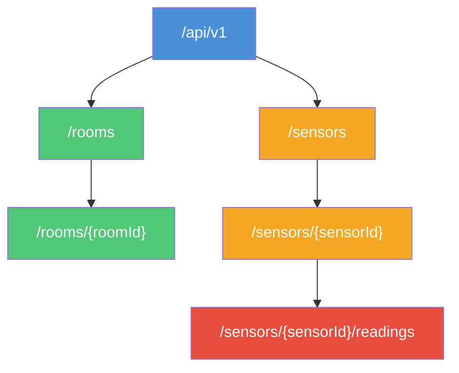
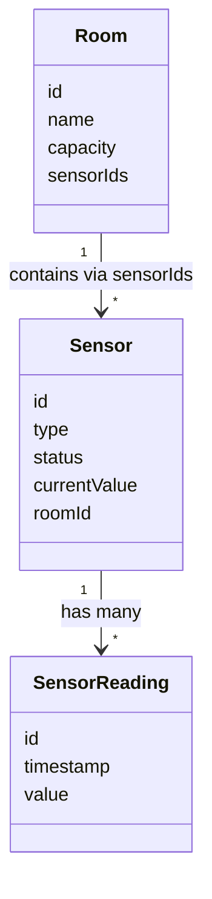

# Smart Campus Sensor & Room Management API

**Module:** 5COSC022W – Client-Server Architectures  
**Student Name:** Thevinu Jayasekara  
**Student ID:** w2152987 / 20241953  
**GitHub Repository:** https://github.com/ThevinuJ/w2152987_csa_cw

---

## Table of Contents

1. [Setup & Run Guide](#setup--run-guide)
2. [API Design Overview](#api-design-overview)
3. [Sample cURL Commands](#sample-curl-commands)
4. [Written Report](#written-report)

---

## Setup & Run Guide

### Prerequisites

- **Java JDK 11** (or higher)
- **NetBeans IDE** 
- **Apache Tomcat 9** 

### Steps to Run

- Clone the repository:
  ```bash
  git clone https://github.com/ThevinuJ/w2152987_csa_cw
  ```
- Open the project in **NetBeans** (File → Open Project → select the project folder).
- Make sure Apache Tomcat 9 is configured as your server in NetBeans (Tools → Servers → Add Server).
- **Build** the project: right-click the project → Clean and Build.
- **Run** the project: right-click the project → Run.
- The API will be available at:
  ```
  http://localhost:8080/api/v1/
  ```
- Press `ENTER` in the terminal to stop the server.

---

## API Design Overview

This API follows a RESTful architecture for managing rooms, sensors, and sensor readings within a smart campus environment. It is built using **JAX-RS (Jersey)** with an embedded **Grizzly HTTP server**. All data is stored **in-memory** using a Singleton `DataStore` class with `ConcurrentHashMap` and `CopyOnWriteArrayList` collections — no external database is used.

The API uses standard HTTP methods (GET, POST, PUT, DELETE) and returns proper HTTP status codes. It includes HATEOAS-style links in the discovery endpoint, custom exception mappers for clean error handling, and a request/response logging filter.

### Architecture Diagram



### Resource Hierarchy



### Domain Model Relationships



### API Endpoints Summary

| Category      | Method   | Endpoint                              | Description                        | Status Codes              |
|:------------- |:-------- |:------------------------------------- |:---------------------------------- |:------------------------- |
| **Discovery** | `GET`    | `/api/v1/`                            | API info & HATEOAS links           | `200 OK`                  |
| **Rooms**     | `GET`    | `/api/v1/rooms`                       | List all rooms                     | `200 OK`                  |
|               | `POST`   | `/api/v1/rooms`                       | Create a new room                  | `201 Created`, `400`, `409` |
|               | `GET`    | `/api/v1/rooms/{roomId}`              | Get a specific room                | `200 OK`, `404`           |
|               | `PUT`    | `/api/v1/rooms/{roomId}`              | Update a room                      | `200 OK`, `404`           |
|               | `DELETE` | `/api/v1/rooms/{roomId}`              | Delete a room                      | `204 No Content`, `404`, `409` |
| **Sensors**   | `GET`    | `/api/v1/sensors`                     | List all sensors (filter: `?type=`) | `200 OK`                  |
|               | `POST`   | `/api/v1/sensors`                     | Create a new sensor                | `201 Created`, `400`, `409`, `422` |
|               | `GET`    | `/api/v1/sensors/{sensorId}`          | Get a specific sensor              | `200 OK`, `404`           |
|               | `PUT`    | `/api/v1/sensors/{sensorId}`          | Update a sensor                    | `200 OK`, `404`, `422`    |
|               | `DELETE` | `/api/v1/sensors/{sensorId}`          | Delete a sensor                    | `204 No Content`, `404`   |
| **Readings**  | `GET`    | `/api/v1/sensors/{sensorId}/readings` | Get readings for a sensor          | `200 OK`, `404`           |
|               | `POST`   | `/api/v1/sensors/{sensorId}/readings` | Add a reading to a sensor          | `201 Created`, `404`, `403` |

---

## Sample CURL Commands

### Discovery

```bash
curl -X GET http://localhost:8080/api/v1/
```

### Rooms

**Create a room:**
```bash
curl -X POST http://localhost:8080/api/v1/rooms \
  -H "Content-Type: application/json" \
  -d '{"id": "room-01", "name": "Lecture Hall A", "capacity": 120}'
```

**Get all rooms:**
```bash
curl -X GET http://localhost:8080/api/v1/rooms
```

**Get a specific room:**
```bash
curl -X GET http://localhost:8080/api/v1/rooms/room-01
```

**Update a room:**
```bash
curl -X PUT http://localhost:8080/api/v1/rooms/room-01 \
  -H "Content-Type: application/json" \
  -d '{"name": "Lecture Hall A - Updated", "capacity": 150}'
```

**Delete a room:**
```bash
curl -X DELETE http://localhost:8080/api/v1/rooms/room-01
```

### Sensors

**Create a sensor (linked to a room):**
```bash
curl -X POST http://localhost:8080/api/v1/sensors \
  -H "Content-Type: application/json" \
  -d '{"id": "sensor-01", "type": "Temperature", "status": "ACTIVE", "currentValue": 0, "roomId": "room-01"}'
```

**Get all sensors:**
```bash
curl -X GET http://localhost:8080/api/v1/sensors
```

**Filter sensors by type:**
```bash
curl -X GET "http://localhost:8080/api/v1/sensors?type=Temperature"
```

**Delete a sensor:**
```bash
curl -X DELETE http://localhost:8080/api/v1/sensors/sensor-01
```

### Sensor Readings

**Add a reading to a sensor:**
```bash
curl -X POST http://localhost:8080/api/v1/sensors/sensor-01/readings \
  -H "Content-Type: application/json" \
  -d '{"value": 23.5}'
```

**Get all readings for a sensor:**
```bash
curl -X GET http://localhost:8080/api/v1/sensors/sensor-01/readings
```

---

## Written Report

### Part 1: Service Architecture & Setup

#### Q1. In your report, explain the default lifecycle of a JAX-RS Resource class. Is a new instance instantiated for every incoming request, or does the runtime treat it as a singleton? Elaborate on how this architectural decision impacts the way you manage and synchronize your in-memory data structures (maps/lists) to prevent data loss or race conditions.

JAX-RS generates a new object of a resource class such as RoomResource every time a single incoming HTTP request is received and removes it. I applied the Singleton pattern to make a DataStore class to avoid the loss of data between requests. This ensures that both my thread-safe Maps and Lists are stored permanently in the memory of the server and therefore every request that comes in is capable of safely accessing and manipulating the same contents.

---

#### Q2. Why is the provision of ”Hypermedia” (links and navigation within responses) considered a hallmark of advanced RESTful design (HATEOAS)? How does this approach benefit client developers compared to static documentation?

HATEOAS refers to using dynamic links within the API response. My root /api/v1 endpoint gives links to the rooms and sensors collections. This assists client developers, as they do not need to hard code URLs, simply follow the links being presented by the server, and the API is much simpler to navigate, and update.

---
### Part 2: Room Management

#### Q1. When returning a list of rooms, what are the implications of returning only IDs versus returning the full room objects? Consider network bandwidth and client side processing.

Returning just the IDs uses less bandwidth because the response payload is smaller. You're only sending a list of short strings, but the client then has to make a separate GET request for each individual room to get the full details, which creates more network round trips. Returning full room objects uses more bandwidth per response, but the client gets all the information it needs in a single request. For a small to medium dataset like a campus system, this approach is usually better because it reduces the total number of API calls and makes the client-side code simpler.

---

#### Q2. Is the DELETE operation idempotent in your implementation? Provide a detailed justification by describing what happens if a client mistakenly sends the exact same DELETE request for a room multiple times.

The initial delete request on a room is 204 No Content success, but on subsequent attempts by the client to delete the same room, 404 Not Found is returned since the room has been deleted. This would change the response per call, strictly speaking, which some believe violates pure idempotency. The most important concept with idempotency is that the state of the server does not change after the initial successful call, the room has already been destroyed and subsequent calls to DELETE do not make any further changes. The various status code is merely the client being informed of the current state by the server hence technically, this is quite acceptable behavior and is a daily occurrence as far as practical and REST are concerned.

---

### Part 3: Sensor Operations & Linking

#### Q1. We explicitly use the @Consumes (MediaType.APPLICATION_JSON) annotation on the POST method. Explain the technical consequences if a client attempts to send data in a different format, such as text/plain or application/xml. How does JAX-RS handle this mismatch?

When a client sends a request, and the Content-Type: text/plain, to an endpoint annotated with @Consumes (MediaType.APPLICATION_JSON) the JAX-RS runtime will reject the request prior to even reaching the resource method. The server will automatically reply with a 415 Unsupported Media Type. The reason is that JAX-RS verifies the incoming media type "Content-Type" with the types mentioned in the media types of the annotation Consumes. The framework can tell that the body cannot be deserialized to the model because the body is not in the correct format namely, it is text/plain, and the framework blocks the request immediately.

---

#### Q2. You implemented this filtering using @QueryParam. Contrast this with an alternative design where the type is part of the URL path (e.g., /api/vl/sensors/type/CO2). Why is the query parameter approach generally considered superior for filtering and searching collections?

Using a @QueryParam like ?type=CO2 is better for filtering because query parameters are designed for optional, non-hierarchical data. The URL/api/v1/sensors represents the whole sensors collection, and adding ?type=CO2 is just narrowing down that collection. The base resource identity stays the same.

---
### Part 4: Deep Nesting with Sub - Resources

#### Q1. Discuss the architectural benefits of the Sub-Resource Locator pattern. How does delegating logic to separate classes help manage complexity in large APIs compared to defining every nested path (e.g., sensors/{id}/readings/{rid}) in one massive controller class?

In my API, the SensorResource class contains a function that has an annotation of the form @Path("/{sensorId}/readings"), which returns a SensorReadingResource object[cite: 52]. This is a sub-resource locator; the primary advantage is that it is a separation of concerns, all the logic to manipulate readings is in a separate class, and the SensorResource class remains clean. This also enhances maintainability and scalability, as operations like deleting or filtering by date can be added by editing the SensorReadingResource class without altering the primary sensor class. It reflects the natural URL structure in the code structure, which simplifies understanding and extending the project.

---

### Part 5: Error Handling, Exception Mapping & Logging

#### Q1. Why is HTTP 422 often considered more semantically accurate than a standard 404 when the issue is a missing reference inside a valid JSON payload?

A 404 Not Found indicates that the URL that the client is attempting to access does not exist. However, when a client POSTs to /api/v1/sensors with a valid JSON body, but the body includes a roomId which does not exist in the system, then the URL itself is not the issue, but the contents of the request body is. Using 404 here would be misleading.

---

#### Q2. From a cybersecurity standpoint, explain the risks associated with exposing internal Java stack traces to external API consumers. What specific information could an attacker gather from such a trace?

An unhandled exception, when the server sends the client a raw Java stack trace, exposes internal implementation details of the server including package names, class names, file paths, library versions and line numbers. This information can be used by the attacker to determine the frameworks and versions the application is utilising and then search them by known vulnerabilities of that specific version. I introduced a GlobalExceptionMapper to handle unhandled Throwable exceptions. Rather than spill the stack trace to the client, it logs the complete information on the server side to debug, and sends a generic and safe error message to the client. The developer will have the benefit of still being able to debug problems based on the logs in the server without revealing anything sensitive to the external users.

---

#### Q3. Why is it advantageous to use JAX-RS filters for cross-cutting concerns like logging, rather than manually inserting Logger.info() statements inside every single resource method?

Added manually with the calls to Logger.info() on the beginning and the end of each single resource method, I would have a lot of duplicated and repetitive code, all over my resource classes. If I have to modify each method separately which is prone to errors and difficult to maintain in case I needed to alter the log format. With a JAX-RS @Provider filter such as my LoggingFilter class that implements both ContainerRequestFilter and ContainerResponseFilter the logging code is coded in one, central location. The filter automatically intercepts all outgoing responses and incoming requests across all the resources classes, without any of the resource classes having to be aware of it. This is based on the cross-cutting concern pattern and has the resource classes entirely concentrating on business logic.

---

### Video demonstration

The full video walkthrough was recorded separately and submitted via Blackboard.

### References

- Course module: 5COSC022W — University of Westminster
- No Spring Boot or database technology was used, as required by the coursework brief
