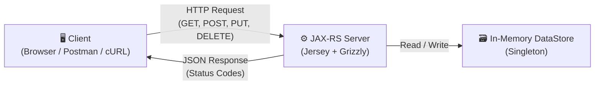
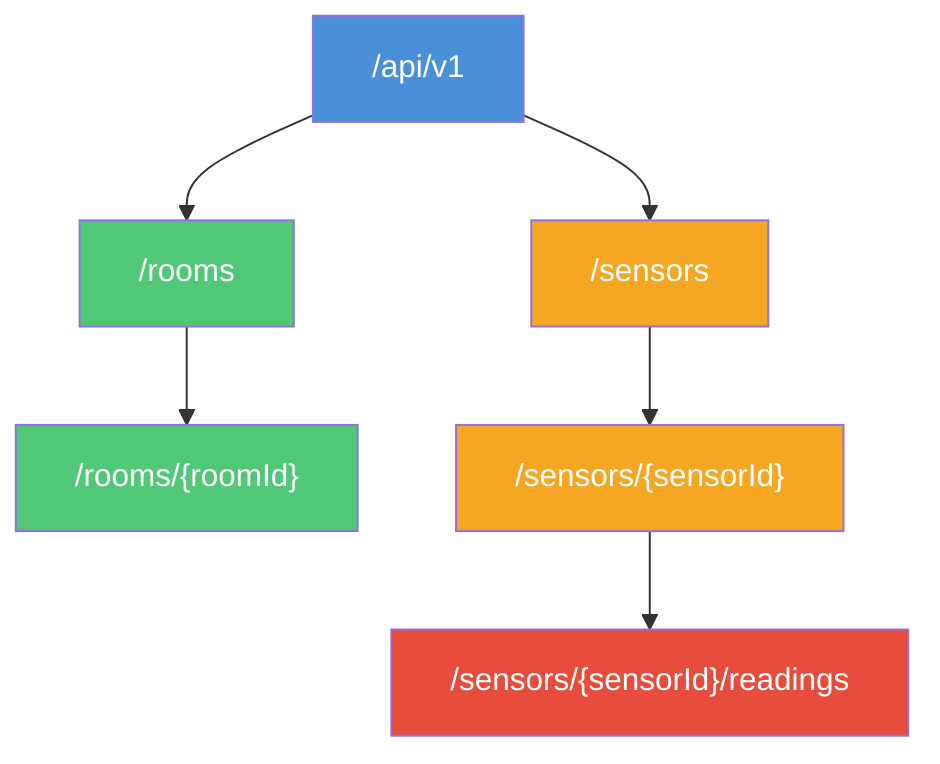
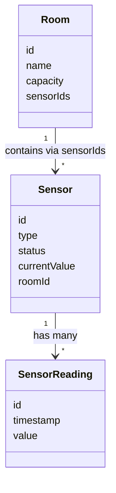

# Smart Campus Sensor & Room Management API

**Module:** 5COSC022W – Client-Server Architectures  
**Student Name:** Thevinu Jayasekara  
**Student ID:** w2152987 / 20241953  
**GitHub Repository:** https://github.com/ThevinuJ/w2152987_csa_cw

---

## Table of Contents

1. [Setup & Run Guide](#setup--run-guide)
2. [API Design Overview](#api-design-overview)
3. [Sample cURL Commands](#sample-curl-commands)
4. [Written Report](#written-report)

---

## Setup & Run Guide

### Prerequisites

- **Java JDK 11** (or higher)
- **NetBeans IDE** (or any Java IDE)
- **Apache Tomcat 9** (configured in your IDE)

### Steps to Run

- Clone the repository:
  ```bash
  git clone https://github.com/ThevinuJ/w2152987_csa_cw
  ```
- Open the project in **NetBeans** (File → Open Project → select the project folder).
- Make sure Apache Tomcat 9 is configured as your server in NetBeans (Tools → Servers → Add Server).
- **Build** the project: right-click the project → Clean and Build.
- **Run** the project: right-click the project → Run.
- The API will be available at:
  ```
  http://localhost:8080/api/v1/
  ```
- Press `ENTER` in the terminal to stop the server.

---

## API Design Overview

This API follows a RESTful architecture for managing rooms, sensors, and sensor readings within a smart campus environment. It is built using **JAX-RS (Jersey)** with an embedded **Grizzly HTTP server**. All data is stored **in-memory** using a Singleton `DataStore` class with `ConcurrentHashMap` and `CopyOnWriteArrayList` collections — no external database is used.

The API uses standard HTTP methods (GET, POST, PUT, DELETE) and returns proper HTTP status codes. It includes HATEOAS-style links in the discovery endpoint, custom exception mappers for clean error handling, and a request/response logging filter.

### Architecture Diagram



### Resource Hierarchy



### Domain Model Relationships



### API Endpoints Summary

| Category      | Method   | Endpoint                              | Description                        | Status Codes              |
|:------------- |:-------- |:------------------------------------- |:---------------------------------- |:------------------------- |
| **Discovery** | `GET`    | `/api/v1/`                            | API info & HATEOAS links           | `200 OK`                  |
| **Rooms**     | `GET`    | `/api/v1/rooms`                       | List all rooms                     | `200 OK`                  |
|               | `POST`   | `/api/v1/rooms`                       | Create a new room                  | `201 Created`, `400`, `409` |
|               | `GET`    | `/api/v1/rooms/{roomId}`              | Get a specific room                | `200 OK`, `404`           |
|               | `PUT`    | `/api/v1/rooms/{roomId}`              | Update a room                      | `200 OK`, `404`           |
|               | `DELETE` | `/api/v1/rooms/{roomId}`              | Delete a room                      | `204 No Content`, `404`, `409` |
| **Sensors**   | `GET`    | `/api/v1/sensors`                     | List all sensors (filter: `?type=`) | `200 OK`                  |
|               | `POST`   | `/api/v1/sensors`                     | Create a new sensor                | `201 Created`, `400`, `409`, `422` |
|               | `GET`    | `/api/v1/sensors/{sensorId}`          | Get a specific sensor              | `200 OK`, `404`           |
|               | `PUT`    | `/api/v1/sensors/{sensorId}`          | Update a sensor                    | `200 OK`, `404`, `422`    |
|               | `DELETE` | `/api/v1/sensors/{sensorId}`          | Delete a sensor                    | `204 No Content`, `404`   |
| **Readings**  | `GET`    | `/api/v1/sensors/{sensorId}/readings` | Get readings for a sensor          | `200 OK`, `404`           |
|               | `POST`   | `/api/v1/sensors/{sensorId}/readings` | Add a reading to a sensor          | `201 Created`, `404`, `403` |

---

## Sample cURL Commands

### Discovery

```bash
curl -X GET http://localhost:8080/api/v1/
```

### Rooms

**Create a room:**
```bash
curl -X POST http://localhost:8080/api/v1/rooms \
  -H "Content-Type: application/json" \
  -d '{"id": "room-01", "name": "Lecture Hall A", "capacity": 120}'
```

**Get all rooms:**
```bash
curl -X GET http://localhost:8080/api/v1/rooms
```

**Get a specific room:**
```bash
curl -X GET http://localhost:8080/api/v1/rooms/room-01
```

**Update a room:**
```bash
curl -X PUT http://localhost:8080/api/v1/rooms/room-01 \
  -H "Content-Type: application/json" \
  -d '{"name": "Lecture Hall A - Updated", "capacity": 150}'
```

**Delete a room:**
```bash
curl -X DELETE http://localhost:8080/api/v1/rooms/room-01
```

### Sensors

**Create a sensor (linked to a room):**
```bash
curl -X POST http://localhost:8080/api/v1/sensors \
  -H "Content-Type: application/json" \
  -d '{"id": "sensor-01", "type": "Temperature", "status": "ACTIVE", "currentValue": 0, "roomId": "room-01"}'
```

**Get all sensors:**
```bash
curl -X GET http://localhost:8080/api/v1/sensors
```

**Filter sensors by type:**
```bash
curl -X GET "http://localhost:8080/api/v1/sensors?type=Temperature"
```

**Delete a sensor:**
```bash
curl -X DELETE http://localhost:8080/api/v1/sensors/sensor-01
```

### Sensor Readings

**Add a reading to a sensor:**
```bash
curl -X POST http://localhost:8080/api/v1/sensors/sensor-01/readings \
  -H "Content-Type: application/json" \
  -d '{"value": 23.5}'
```

**Get all readings for a sensor:**
```bash
curl -X GET http://localhost:8080/api/v1/sensors/sensor-01/readings
```

---

## Written Report

### Part 1: Service Architecture & Setup

#### Q1. In your report, explain the default lifecycle of a JAX-RS Resource class. Is a new instance instantiated for every incoming request, or does the runtime treat it as a singleton? Elaborate on how this architectural decision impacts the way you manage and synchronize your in-memory data structures (maps/lists) to prevent data loss or race conditions.

By default, JAX-RS resource classes are **per-request**, meaning a new instance of the class is created every time a client sends a request. This means if you store data in a regular instance variable inside the resource class, that data will be lost after the request finishes because the object gets garbage collected.

To solve this problem, I used a **Singleton `DataStore` class** that holds all the data in `ConcurrentHashMap` collections. Since every new resource instance calls `DataStore.getInstance()`, they all access the same shared data object, so data is kept alive across all requests for as long as the server is running.

---

#### Q2. Why is the provision of ”Hypermedia” (links and navigation within responses) considered a hallmark of advanced RESTful design (HATEOAS)? How does this approach benefit client developers compared to static documentation?

HATEOAS (Hypermedia as the Engine of Application State) means the server includes **links in its responses** that tell the client what actions or resources are available next. In my API, the discovery endpoint at `/api/v1/` returns a `_links` object pointing to `/api/v1/rooms` and `/api/v1/sensors`.

This is helpful for client developers because they don't need to hardcode every URL in their application. They can start from the root endpoint and follow the links dynamically, which makes it easier to use the API and also means the server can change its URL structure without breaking the client.

---
### Part 2: Room Management

#### Q1. When returning a list of rooms, what are the implications of returning only IDs versus returning the full room objects? Consider network bandwidth and client side processing.

**Returning just the IDs** uses less bandwidth because the response payload is smaller — you're only sending a list of short strings. However, the downside is that the client then has to make a separate GET request for each individual room to get the full details, which creates more network round trips.

**Returning full room objects** (which is what my API does) uses more bandwidth per response, but the client gets all the information it needs in a single request. For a small-to-medium dataset like a campus system, this approach is usually better because it reduces the total number of API calls and makes the client-side code simpler.

---

#### Q2. Is the DELETE operation idempotent in your implementation? Provide a detailed justification by describing what happens if a client mistakenly sends the exact same DELETE request for a room multiple times.

In my implementation, the first `DELETE` request for a room returns **204 No Content** (success), but if the client tries to delete the same room again, it returns **404 Not Found** because the room no longer exists. Strictly speaking, this means the response changes between calls, which some argue breaks pure idempotency.

However, the key idea behind idempotency is that the **server state** doesn't change after the first successful call — the room is already gone, and calling DELETE again doesn't alter anything further. The different status code is really just the server informing the client about the current state, so from a practical and REST perspective, this behaviour is perfectly acceptable and commonly used.

---

### Part 3: Sensor Operations & Linking

#### Q1. We explicitly use the @Consumes (MediaType.APPLICATION_JSON) annotation on the POST method. Explain the technical consequences if a client attempts to send data in a different format, such as text/plain or application/xml. How does JAX-RS handle this mismatch?

If a client sends a request with the `Content-Type: text/plain` header to an endpoint that is annotated with `@Consumes(MediaType.APPLICATION_JSON)`, the JAX-RS runtime will **reject the request** before it even reaches the resource method. The server will automatically return a **415 Unsupported Media Type** response.

This happens because JAX-RS checks the incoming `Content-Type` header against the media types listed in `@Consumes`. Since `text/plain` does not match `application/json`, the framework knows it cannot deserialize the body into the expected Java object (e.g., a `Room` POJO), so it blocks the request right away.

---

#### Q2. You implemented this filtering using @QueryParam. Contrast this with an alternative design where the type is part of the URL path (e.g., /api/vl/sensors/type/CO2). Why is the query parameter approach generally considered superior for filtering and searching collections?

Using a **`@QueryParam`** like `?type=CO2` is better for filtering because query parameters are designed for optional, non-hierarchical data. The URL `/api/v1/sensors` represents the whole sensors collection, and adding `?type=CO2` is just narrowing down that collection. The base resource identity stays the same.

If I used a path segment like `/sensors/type/CO2`, it would imply that `type/CO2` is a distinct, separate resource in the URL hierarchy, which it isn't — it's just a filtered view of the same collection. Query parameters are also easier to combine (e.g., `?type=CO2&status=ACTIVE`) without creating complicated nested URL paths.

---
### Part 4: Deep Nesting with Sub - Resources

#### Q1. Discuss the architectural benefits of the Sub-Resource Locator pattern. How does delegating logic to separate classes help manage complexity in large APIs compared to defining every nested path (e.g., sensors/{id}/readings/{rid}) in one massive controller class?

In my API, the `SensorResource` class has a method annotated with `@Path("/{sensorId}/readings")` that returns a `SensorReadingResource` object. This is a **sub-resource locator** pattern. The main benefit is **separation of concerns** — all the logic for handling readings (GET, POST) lives in its own class, keeping the `SensorResource` class clean and focused only on sensor-level operations.

This also improves **maintainability and scalability**. If I ever need to add more operations for readings (like DELETE or filtering by date), I only need to modify the `SensorReadingResource` class without touching the main sensor class. It mirrors the natural URL hierarchy (`/sensors/{id}/readings`) in the code structure, making the project easier to understand and extend.

---

### Part 5: Error Handling, Exception Mapping & Logging

#### Q1. Why is HTTP 422 often considered more semantically accurate than a standard 404 when the issue is a missing reference inside a valid JSON payload?

A **404 Not Found** means the URL the client is requesting doesn't exist. But when a client POSTs to `/api/v1/sensors` with a valid JSON body that contains a `roomId` that doesn't exist in the system, the URL itself is perfectly fine — it's the **content of the request body** that has the problem. Using 404 here would be misleading.

**422 Unprocessable Entity** is the correct choice because it tells the client: "I received your request, the JSON is well-formed, but I can't process it because the data inside it is semantically invalid." In my implementation, this is handled by throwing a `LinkedResourceNotFoundException`, which the `LinkedResourceNotFoundExceptionMapper` catches and returns a 422 response with a clear error message.

---

#### Q2. From a cybersecurity standpoint, explain the risks associated with exposing internal Java stack traces to external API consumers. What specific information could an attacker gather from such a trace?

When an unhandled exception occurs and the server returns a raw Java stack trace to the client, it reveals **internal implementation details** such as package names, class names, file paths, library versions, and even line numbers. An attacker can use this information to identify which frameworks and versions the application is using and then look for known vulnerabilities for those specific versions.

This is why I implemented a `GlobalExceptionMapper` that catches all unhandled `Throwable` exceptions. Instead of leaking the stack trace to the client, it logs the full details on the server side (for debugging) and returns a generic, safe error message like *"An unexpected error occurred. Please contact support."* to the client. This way, the developer can still debug issues from the server logs without exposing anything sensitive to external users.

---

#### Q3. Why is it advantageous to use JAX-RS filters for cross-cutting concerns like logging, rather than manually inserting Logger.info() statements inside every single resource method?

If I manually added `Logger.info()` calls at the start and end of every single resource method, I would have a lot of **duplicated, repetitive code** scattered across all my resource classes. If I ever wanted to change the log format or add extra information, I would have to update every single method individually, which is error-prone and hard to maintain.

By using a JAX-RS `@Provider` filter like my `LoggingFilter` class (which implements both `ContainerRequestFilter` and `ContainerResponseFilter`), the logging logic is written **once** in a single, central place. The filter automatically intercepts every incoming request and outgoing response across the entire API without any of the resource classes needing to know about it. This follows the **cross-cutting concern** pattern and keeps the resource classes focused purely on business logic.

---

### Video demonstration

The full video walkthrough was recorded separately and submitted via Blackboard.

### References

- Course module: 5COSC022W — University of Westminster
- No Spring Boot or database technology was used, as required by the coursework brief
